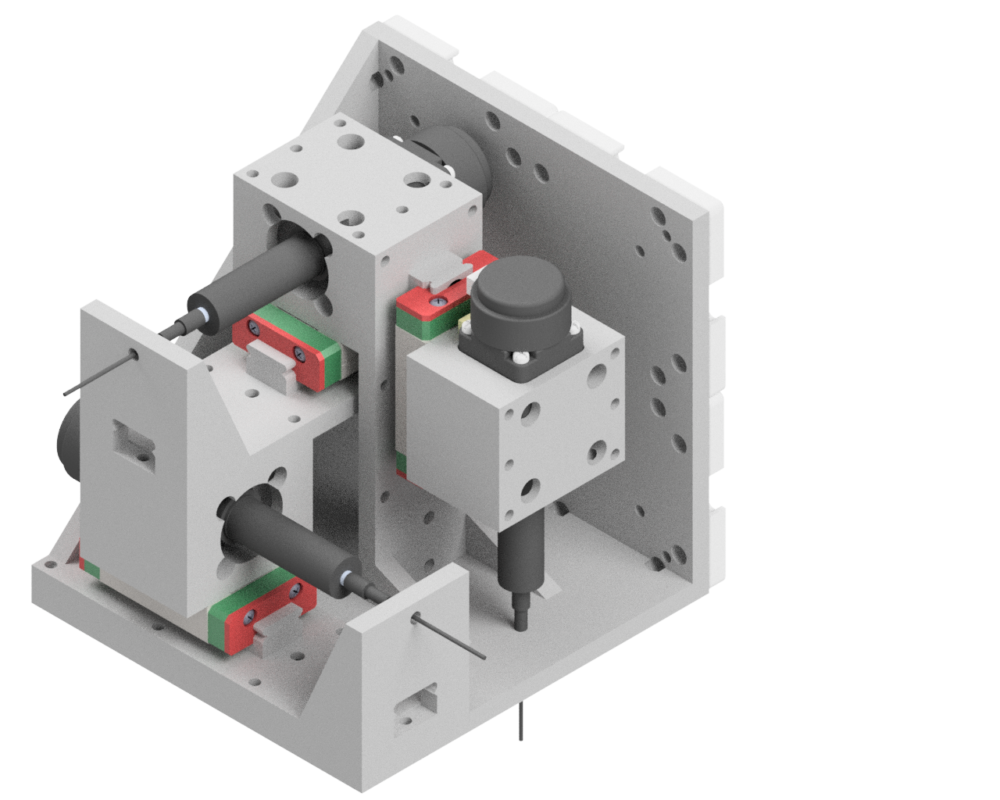
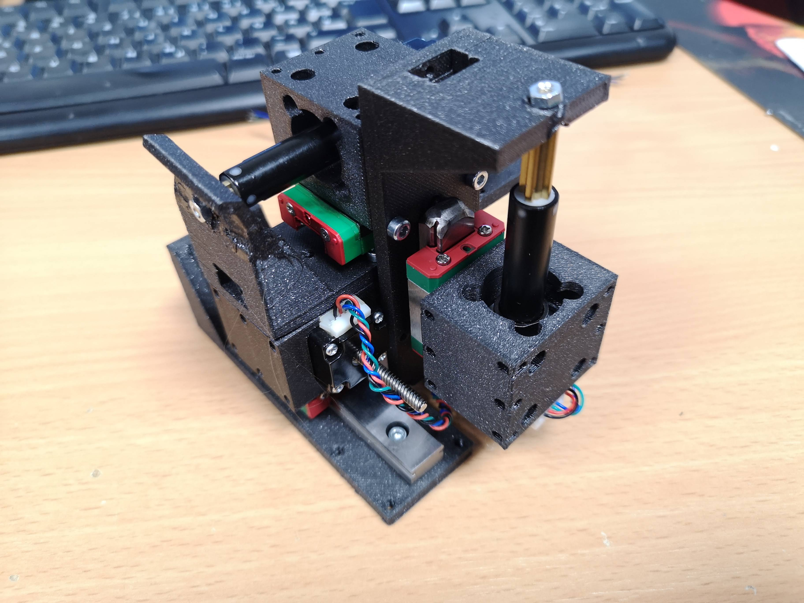

# openUC2 *XYZ motorized micromanipulator*
---

IMG_20221219_204302.jpg
IMG_20221220_171253.jpg

This repository will help you to build and setup a compact motorized XYZ manipulator.

The model is based on non-captive nema 8 stepper motors and MGN12H guid blocks and rails. The motorized linear elements can be stacked to form an XYZ linear actuator. Depending on the linear stepper motors you can achieve sub micrometer precision. The pice varies between 300-1200€ depending on the accuracy.

Curious to see what this looks like? Keep scrolling!

***Features:***
* Uses only off-the-shelf components
* Few 3D printed components
* sub- to micrometer accuracy
* adaptable
* Ideal for: Light-sheet sample positioning
* robotic actuation
* compact: ~100m^3

## In-Action

We use our UC2-ESP firmware to control the steppers using the UC2 board. Software available here https://github.com/youseetoo/uc2-esp32/ or via the web flashing tool here: https://youseetoo.github.io/

# Software

For additional information regarding the software, please have a look here: http://openuc2.github.io/ => electronics/ImSwitch

# Hardware

Below we describe how the device can be build and assembled in order to replicate the whole system as shown in the rendering above. One needs additional parts that can be found in the core [openUC2 repository](https://github.com/bionanoimaging/UC2-GIT).

## Bill of material

Below you will find all components necessary to build this device

### 3D printing files

All these files need to be printed. We used a Prusa i3 MK3 using PLA Prusament (Galaxy Black) at layer height x.x mm and infill xx%.

|  Type | Details  |  Price | Link  |
|---|---|---|---|
| *FANCY* Holder |  *IT HOLD OTHER FANCY PARTS* |  x,xx € | [Part.stl](./STL/)  |

### Additional parts
This is used in the current version of the setup

| #        | Name                                   | URL                                                                                                                                                                                                                                                       | Price | Quantity |
| -------- | -------------------------------------- | --------------------------------------------------------------------------------------------------------------------------------------------------------------------------------------------------------------------------------------------------------- | ----- | -------- |
| 1        | 00\_MGN12H, LINEAR GUIDE BLOCK         | https://www.roboter-bausatz.de/p/mgn15h-linearlager                                                                                                                                                                                                       | 10    | 3        |
| 02\. Jan | 00\_MGN12H, LINEAR GUIDE RAIL, 100mm   | https://www.roboter-bausatz.de/p/linearfuehrung-mgn15h-200mm                                                                                                                                                                                              | 10    | 3        |
| 3        | 00\_Joy-IT-B20SHD4353\_NEMA8\_captive  | https://www.pollin.de/p/joy-it-schrittmotor-nema08-04la-b20shd4353-c38l-0-5kg-5-28v-0-24a-20x22x27-5-310849?utm\_source=google&utm\_medium=fshopping&gclid=Cj0KCQiA-oqdBhDfARIsAO0TrGHcPGG7kG0SjzD546-4Ragk9djuzecQVFhU\_7quCEyT05HZxfYgtwQaAqXBEALw\_wcB | 60    | 3        |
| 4        | 30\_Linear\_Captive\_Nema8\_Guidemount | printed                                                                                                                                                                                                                                                   | 1     | 3        |
| 5        | 30\_Linear\_Captive\_Nema8\_Base       | printed                                                                                                                                                                                                                                                   | 2     | 3        |
| 6        | 30\_Linear\_Captive\_Nema8\_Stand      |                                                                                                                                                                                                                                                       printed    | 5     | 1        |

### Design files

The original design files are in the [INVENTOR](./INVENTOR) folder.

## Showcase
*AWESOME RESULTS!*

***Fig 1.*** *MY MOST AWSOME IMAGE*

## Get Involved

This project is open so that anyone can get involved. You don't even have to learn CAD designing or programming. Find ways you can contribute in  [CONTRIBUTING](https://github.com/openUC2/UC2-GIT/blob/master/CONTRIBUTING.md)

## License and Collaboration

This project is open-source and is released under the CERN open hardware license. Our aim is to make the kits commercially available.
We encourage everyone who is using our Toolbox to share their results and ideas, so that the Toolbox keeps improving. It should serve as a easy-to-use and easy-to-access general purpose building block solution for the area of STEAM education. All the design files are generally for free, but we would like to hear from you how is it going.

You're free to fork the project and enhance it. If you have any suggestions to improve it or add any additional functions make a pull-request or file an issue.

Please find the type of licenses [here](https://github.com/openUC2/UC2-GIT/blob/master/License.md)

REMARK: All files have been designed using Autodesk Inventor 2019 (EDUCATION)

## Collaborating
If you find this project useful, please like this repository, follow us on Twitter and cite the webpage! :-)
